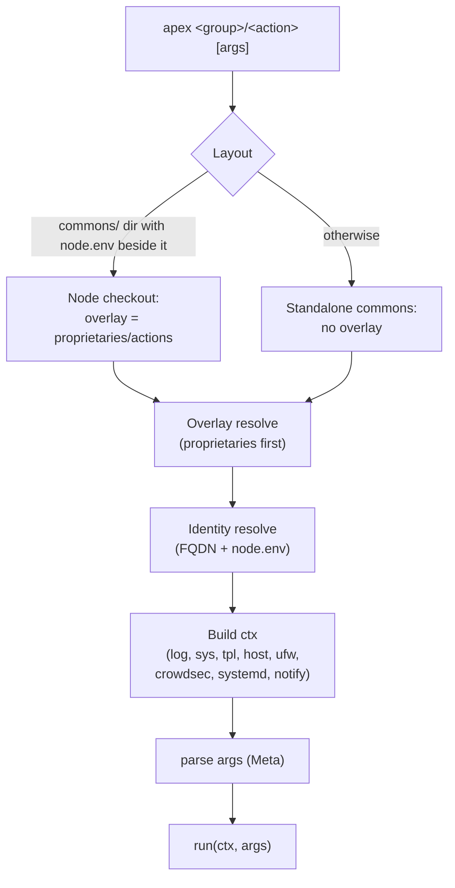

apex splits fleet automation into one shared repository — the [commons](/apex/glossary#commons) — and one repository per [node](/apex/glossary#node). The commons carries everything every node shares: the [engine](/apex/glossary#engine), the shared [actions](/apex/glossary#action), and the [core composition](/apex/glossary#core-composition). A node repository carries everything that makes that node itself: its identity, host [configs](/apex/glossary#configs), service [compositions](/apex/glossary#compositions), and node-local [proprietaries](/apex/glossary#proprietaries).

## The four pillars {#pillars}

Every node repository has the same shape:



  
  
  
  
  
  



| Pillar | Content | Ownership |
|---|---|---|
| `commons/` | Git submodule → `apex.ermnvldmr.com`, pinned to a release tag | Shared, versioned |
| `proprietaries/` | Node-local actions, libraries, and tool sources ([overlaid](/apex/glossary#overlay) over commons) | Node |
| `configs/` | Host configuration sources: `ufw/`, `cron/crontab`, `systemd/`, `crowdsec/` | Node |
| `compositions/` | One directory per project plus the `apex/` core wrapper and the addressing ledger | Node |

The submodule pin is the framework's version contract: a node runs exactly the engine and core composition recorded in its gitlink. Upgrading a node is a deliberate act — check out a newer tag inside `commons/` and commit the moved pointer.

## Dispatch flow {#dispatch}

The launcher `commons/apex` acts on the local checkout; there is no node argument anywhere.

The engine detects the layout from its own location: running from a directory named `commons/` whose parent contains `node.env` means "node checkout" — the parent becomes the repository root and `proprietaries/actions/` becomes the overlay tree. Any other location is a standalone commons checkout acting as its own root.

Listing (`apex --help`) never imports action modules; summaries and disabled markers are extracted by static `ast` scanning. Dispatch loads exactly one module by path. Details in [Concept: Actions and the overlay](/apex/concepts/actions-and-overlay).

## The capture-up model {#capture-up}

Node repositories are ledgers, not just sources: the host itself records what it runs.

1. A scheduled `sync/repository` run on the host commits the working tree to a `sync/<node>` branch (including the commons submodule pointer), rebases it onto `origin/main`, and pushes with `--force-with-lease`.
2. A scheduled CI job in the node repository merges `sync/<node>` back into `main` under a bot identity.

This [capture-up](/apex/glossary#capture-up) loop means drift on a host becomes a commit — visible, diffable, and revertable — instead of silent divergence. The sync aborts rather than committing when the commons submodule is dirty or the `compositions/` tree is missing, so a broken checkout never becomes the recorded state.

> [!NOTE]
> The CI merge job checks out the repository *without* submodules: the commons submodule uses an SSH URL that the default CI token cannot fetch, and the merge only moves the gitlink pointer anyway.

## Design constraints {#constraints}

- **Stdlib only.** The engine runs on a stock Debian Python 3 — no `pip`, no third-party imports. The optional `vendor/` directory exists for pinned pure-Python code but ships empty.
- **Hand-authored composes.** There is no manifest layer or code generation; compose files are the source of truth.
- **Evidence over convention.** Anything enforceable is enforced by an action (anchor-IP lint, crontab rollback, marker-block self-healing) rather than by documentation.

---

**See also:**

- [Concept: Actions and the overlay](/apex/concepts/actions-and-overlay)
- [Concept: Node identity resolution](/apex/concepts/node-identity)
- [Guide: Build a node repository](/apex/guides/node-repository)
