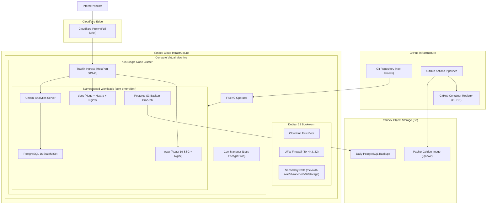

The `ermnvldmr.com` infrastructure architecture combines immutable OS image baking, autonomous cloud-init bootstrapping, and declarative Flux GitOps reconciliation into a single unified deployment model.

---

## 1. High-Level System Architecture

---

## 2. Platform Lifecycle Stages

The lifecycle of the platform operates in three distinct phases:

### Phase 1: Golden Image Build (Packer)
1. **Automated Trigger**: GitHub Actions runs `.github/workflows/ci-next-build-golden-image.yml`.
2. **QEMU Virtualization**: Packer launches a headless QEMU Debian 12 installation with preseed automation (`preseed.cfg`).
3. **Provisioning**:
   * Installs base system packages (`curl`, `git`, `htop`, `fail2ban`, `ufw`, `qemu-guest-agent`, `isc-dhcp-client`).
   * Configures `ds-identify` with `policy: enabled` so cloud-init is guaranteed to run.
   * Pre-installs K3s binary (`INSTALL_K3S_SKIP_ENABLE=true`, `INSTALL_K3S_SKIP_START=true`).
   * Strips machine identity (`/etc/machine-id`, DBus ID, SSH host keys, network MAC caches) for clean first-boot isolation.
4. **S3 Upload & Quota Management**: Converts image to compressed `qcow2` format, prunes older images in `dev/images/` to prevent bucket exhaustion, and uploads the verified golden image to Yandex Object Storage (S3).

---

### Phase 2: Autonomous First-Boot (Cloud-Init)
When a VM is created from the golden image with `ci/cloud-init/user-data.template.yaml`:
1. **User & Network Setup**:
   * Creates administrative user `adam` with public SSH key.
   * Disables password authentication and root direct SSH access.
   * Configures reliable fallback DNS nameservers (`1.1.1.1`, `8.8.8.8`, `77.88.8.8`).
2. **Security & Kernel Hardening**:
   * Applies sysctl rules: SYN flood protection, disabling ICMP redirects, source routing protection, and strict reverse path filtering.
   * Configures UFW firewall rules allowing only SSH (22), Traefik HTTP (80), and Traefik HTTPS (443), while routing pod CIDR (`10.42.0.0/16`) and service CIDR (`10.43.0.0/16`).
   * Enables Fail2ban.
3. **Persistent Secondary Storage**:
   * Detects secondary virtual disk `/dev/vdb`.
   * Formats with `ext4` and filesystem label `k3s-storage` if not yet formatted.
   * Mounts to `/var/lib/rancher/k3s/storage` and persists mount configuration in `/etc/fstab`.
4. **K3s & GitOps Engine Startup**:
   * Starts `k3s.service` with built-in ServiceLB enabled.
   * Injects the SOPS age decryption key into Kubernetes secret `flux-system/sops-age`.
   * Installs Flux v2 custom resource definitions and controllers.
   * Applies the root GitOps sync (`GitRepository` + `Kustomization`) pointing directly to `https://github.com/deytenit/ermnvldmr.com.git` on branch `next`.

---

### Phase 3: Continuous Reconciliation & Delivery (GitOps)
1. **Flux Controller**:
   * Polls the `next` branch every 1 minute for repository changes.
   * Evaluates Kustomize overlays in `ci/k8s/clusters/production`.
   * Automatically decrypts `*.sops.yaml` secrets in-cluster using the injected `sops-age` key.
   * Enforces zero-downtime rolling update strategies (`maxUnavailable: 0`, `maxSurge: 1`).
2. **Ingress & TLS Automation**:
   * Traefik binds HostPorts 80 and 443.
   * Cert-Manager solves Let's Encrypt HTTP-01 challenges via Ingress routes.
   * Cloudflare Edge operates in **Full (strict)** SSL mode, proxying traffic securely to Traefik.
