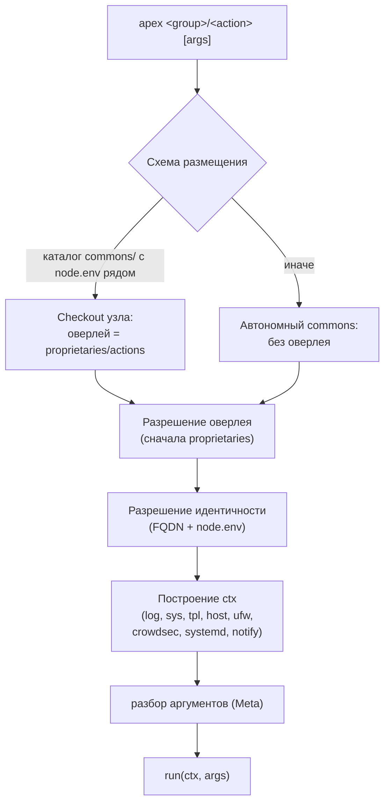

apex разделяет автоматизацию флота на один общий репозиторий — [«commons» (общий репозиторий)](/apex/glossary#commons) — и по одному репозиторию на каждый [узел](/apex/glossary#node). «commons» несёт всё то, что общее для каждого узла: [движок](/apex/glossary#engine), общие [действия](/apex/glossary#action) и [ядровую композицию](/apex/glossary#core-composition). Репозиторий узла несёт всё то, что делает этот узел самим собой: его идентичность, хостовые [конфигурации](/apex/glossary#configs), сервисные [композиции](/apex/glossary#compositions) и узло-локальные [проприетарии](/apex/glossary#proprietaries).

## Четыре опоры {#pillars}

Каждый репозиторий узла имеет одинаковую структуру:



  
  
  
  
  
  



| Опора | Содержимое | Владение |
|---|---|---|
| `commons/` | Git-субмодуль → `apex.ermnvldmr.com`, закреплённый на релизном теге | Общее, версионируемое |
| `proprietaries/` | Узло-локальные действия, библиотеки и исходники инструментов ([накладываются оверлеем](/apex/glossary#overlay) поверх commons) | Узел |
| `configs/` | Исходники конфигурации хоста: `ufw/`, `cron/crontab`, `systemd/`, `crowdsec/` | Узел |
| `compositions/` | По одному каталогу на проект плюс ядровая обёртка `apex/` и реестр адресации | Узел |

Закрепление субмодуля — это версионный контракт фреймворка: узел выполняет ровно тот движок и ту ядровую композицию, которые записаны в его gitlink. Обновление узла — это осознанное действие: переключитесь на более новый тег внутри `commons/` и зафиксируйте перемещённый указатель.

## Поток диспетчеризации {#dispatch}

Лаунчер `commons/apex` действует на локальный checkout; аргумента узла нет нигде.

Движок определяет схему размещения по своему собственному расположению: запуск из каталога с именем `commons/`, родитель которого содержит `node.env`, означает «checkout узла» — родитель становится корнем репозитория, а `proprietaries/actions/` становится деревом оверлея. Любое другое расположение — это автономный checkout commons, выступающий в роли собственного корня.

Перечисление (`apex --help`) никогда не импортирует модули действий; краткие описания и маркеры отключённых действий извлекаются статическим сканированием через `ast`. Диспетчеризация загружает ровно один модуль по пути. Подробности в [Концепция: Действия и оверлей](/apex/concepts/actions-and-overlay).

## Модель «capture-up» {#capture-up}

Репозитории узлов — это реестры, а не просто источники: хост сам записывает то, что он выполняет.

1. Запланированный запуск `sync/repository` на хосте фиксирует рабочее дерево в ветку `sync/<node>` (включая указатель субмодуля commons), выполняет rebase на `origin/main` и отправляет с `--force-with-lease`.
2. Запланированное CI-задание в репозитории узла вливает `sync/<node>` обратно в `main` под идентичностью бота.

Этот цикл «capture-up» ([capture-up](/apex/glossary#capture-up)) означает, что дрейф на хосте превращается в коммит — видимый, поддающийся сравнению через diff и откату — вместо тихого расхождения. Синхронизация прерывается вместо фиксации, если субмодуль commons «грязный» или дерево `compositions/` отсутствует, поэтому сломанный checkout никогда не становится записанным состоянием.

> [!NOTE]
> CI-задание слияния выполняет checkout репозитория *без* субмодулей: субмодуль commons использует SSH-URL, который стандартный CI-токен не может получить, и слияние в любом случае лишь перемещает указатель gitlink.

## Проектные ограничения {#constraints}

- **Только stdlib.** Движок работает на штатном Python 3 из Debian — без `pip`, без сторонних импортов. Опциональный каталог `vendor/` существует для закреплённого чистого Python-кода, но поставляется пустым.
- **Composes, написанные вручную.** Нет слоя манифестов или генерации кода; compose-файлы являются источником истины.
- **Свидетельство важнее соглашения.** Всё, что может быть обеспечено принудительно, обеспечивается действием (линт якорного IP, откат crontab, самовосстановление блоков-маркеров), а не документацией.

---

**См. также:**

- [Концепция: Действия и оверлей](/apex/concepts/actions-and-overlay)
- [Концепция: Разрешение идентичности узла](/apex/concepts/node-identity)
- [Руководство: Сборка репозитория узла](/apex/guides/node-repository)
