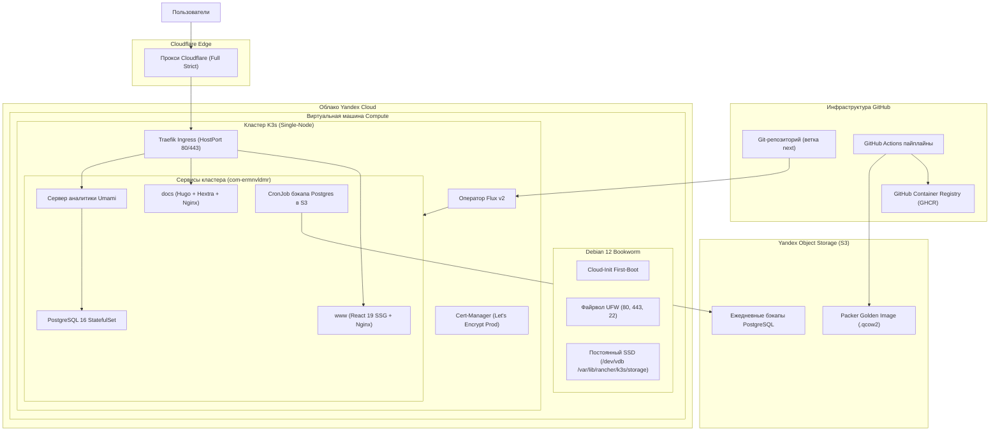

Архитектура инфраструктуры `ermnvldmr.com` объединяет запекание неизменяемых образов ОС, автономную bootstrap-инициализацию через cloud-init и декларативную GitOps-синхронизацию Flux в единую надежную модель развертывания.

---

## 1. Общая схема системы

---

## 2. Фазы жизненного цикла платформы

### Фаза 1: Сборка Golden Image (Packer)
1. **Автоматический запуск**: GitHub Actions выполняет `.github/workflows/ci-next-build-golden-image.yml`.
2. **QEMU-виртуализация**: Packer запускает виртуальную установку Debian 12 с автоматизацией preseed (`preseed.cfg`).
3. **Инициализация**:
   * Установка системных утилит (`curl`, `git`, `htop`, `fail2ban`, `ufw`, `qemu-guest-agent`, `isc-dhcp-client`).
   * Настройка `/etc/cloud/ds-identify.cfg` с `policy: enabled` для гарантированного старта cloud-init.
   * Предустановка бинарного файла K3s (`INSTALL_K3S_SKIP_ENABLE=true`, `INSTALL_K3S_SKIP_START=true`) в `/usr/local/bin/k3s`.
   * Сброс идентичности хоста (`/etc/machine-id`, DBus ID, ключи SSH, сетевые кэши).
4. **Сжатие и загрузка в S3**: Образ конвертируется в `qcow2`, старые образы в `dev/images/` автоматически удаляются для соблюдения квот хранилища, и готовый образ загружается в S3.

---

### Фаза 2: Автономный первый запуск (Cloud-Init)
При создании виртуальной машины с метаданными `ci/cloud-init/user-data.template.yaml`:
1. **Настройка пользователей и сети**:
   * Создание пользователя `adam` с публичным SSH-ключом и правами sudo без пароля.
   * Отключение парольной аутентификации и прямого доступа root по SSH.
   * Конфигурация fallback DNS-серверов (`1.1.1.1`, `8.8.8.8`, `77.88.8.8`).
2. **Харденинг ядра и безопасность**:
   * Применение правил sysctl (защита от SYN Flood, запрет ICMP redirects, фильтрация обратного пути rp_filter).
   * Настройка UFW: открыты только порты 22 (SSH), 80 (HTTP Traefik) и 443 (HTTPS Traefik), настроена внутренняя маршрутизация подсетей K3s Pods (`10.42.0.0/16`) и Services (`10.43.0.0/16`).
   * Включение службы Fail2ban.
3. **Подключение постоянного SSD**:
   * Определение вторичного диска `/dev/vdb`.
   * Автоматическое форматирование в `ext4` с меткой `k3s-storage`, если диск не был отформатирован.
   * Монтирование в `/var/lib/rancher/k3s/storage` и добавление записи в `/etc/fstab`.
4. **Запуск K3s и GitOps-движка**:
   * Старт службы `k3s.service` с активным ServiceLB.
   * Создание секрета `flux-system/sops-age` с ключом дешифрования.
   * Установка CRD и контроллеров Flux v2.
   * Применение корневого манифеста синхронизации (`GitRepository` + `Kustomization`), привязанного к ветке `next`.

---

### Фаза 3: Непрерывная доставка и синхронизация (GitOps)
1. **Контроллер Flux**:
   * Опрашивает ветку `next` каждую 1 минуту.
   * Применяет Kustomize-оверлеи из `ci/k8s/clusters/production`.
   * Дешифрует секреты `*.sops.yaml` прямо внутри кластера с помощью ключа Age.
   * Гарантирует бесшовный rollout подов (`maxUnavailable: 0`, `maxSurge: 1`).
2. **Сетевой уровень и TLS**:
   * Traefik слушает порты 80 и 443.
   * Cert-Manager валидирует HTTP-01 ACME challenge от Let's Encrypt через правила Ingress.
   * Прокси Cloudflare работает в режиме **Full (strict)**, обеспечивая максимальный уровень безопасности.
